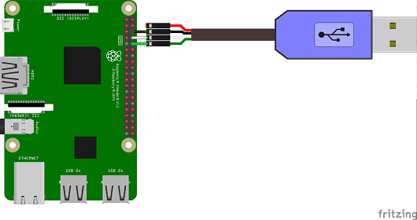
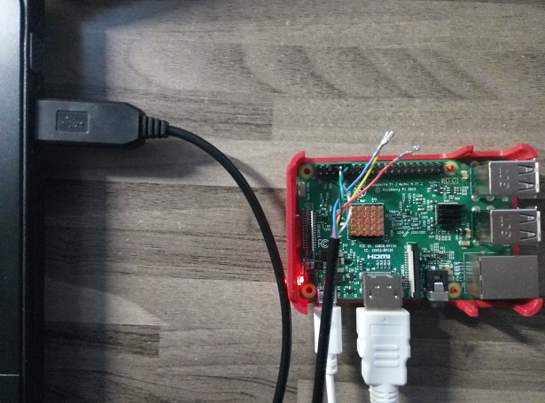
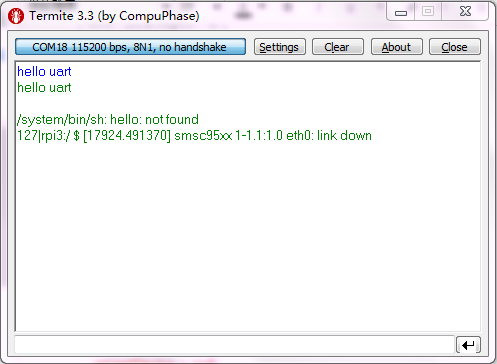

# uartdemo
该项目演示了UART接口的基本使用

##  硬件准备
在运行该项目之前，我们要准备如下元器件：
* 树莓派3开发板 1块
* FTDI芯片 TTL-232R-3V3 USB转TTL线 1根

>广告时间咯：如果你还没有自己的开发板和元器件，到我们的“1024工场微店”来逛逛一逛吧（文章底部二维码），这里能一次性有买到你想要的！

## 电路图


## 构建运行
1. 在Android Studio中，点击Run即可。
2. 如果你通过gradle命令进行构建，则：
```bash
gradle installDebug
adb shell am start com.chengxiang.uartdemo/.MainActivity
```

## 运行效果
我们是以windows系统演示，故使用了Termite终端，设置串口（相关驱动推荐使用驱动人生自动安装） 连接参数（与代码中一致，相关操作这里就不详细介绍）。



在终端输入hello uart（蓝色），就收到返回的hello uart（红色）



* * * * *
*1.新技术，新未来！欢迎大家关注“1024工场”微信服务号，时刻关注我们的最新的技术讯息。*

     

*2.抛弃各种找元器件的烦恼，来“1024工场”微店，一次性买到你所想要的。*

 

*3.加入“Android Things开发”QQ讨论群，一起学习一起Hi。（甭客气！尽情的扫描或者长按！）*

         